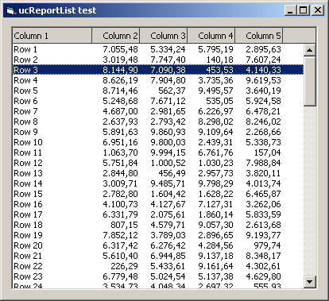



## ucReportList \(Simple multicolumn ListBox \+ headers \+ column alignment\)

### Description

 
### More Info
 

             |
---                |---
**Submitted On**   |2003-12-22 14:05:02
**By**             |[Carles P\.V\.](https://github.com/Planet-Source-Code/PSCIndex/blob/master/ByAuthor/carles-p-v.md)
**Level**          |Beginner
**User Rating**    |4.9 (84 globes from 17 users)
**Compatibility**  |VB 6\.0
**Category**       |[Custom Controls/ Forms/  Menus](https://github.com/Planet-Source-Code/PSCIndex/blob/master/ByCategory/custom-controls-forms-menus__1-4.md)
**World**          |[Visual Basic](https://github.com/Planet-Source-Code/PSCIndex/blob/master/ByWorld/visual-basic.md)
**Archive File**   |[ucReportLi16860512222003\.zip](https://github.com/Planet-Source-Code/carles-p-v-ucreportlist-simple-multicolumn-listbox-headers-column-alignment__1-50423/archive/master.zip)

